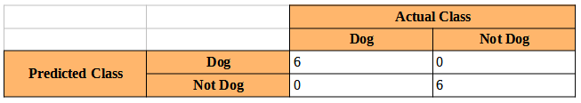

<head>
    <h1 align="center">Dog Breed Identification Project</h1>
    <h2 align="center">Udacity Data Scientist Course</h2>
    <h3 align="center">Capstone project</h3>
</head>

<i>by: Eduardo Passeto</i>

<i>Udacian student</i>

---

**I. Project Overview**

The main idea of this project is to Data Scientist students have contact with the **Perceptron** technology. Udacity course for Data Science is an immersive course about how to deal and enhance data, in a lot of ways, as building **ETL**s, **Machine Learning Classifiers and Regressors**, and a lot of other techniques. As extra-classes, we can find material to deal and to build a **Deep Learning** Classifier.

[my GitHub repo](https://github.com/epasseto/UdacityDataScienceCapstone)

So, basically, you show to a pre-trained Perceptron a picture, as that one of this guy over here (*no matter about rights about the image – it is myself!*):

And it will says something as:

> *“Sorry, nothing detected!*
> *…so, please check this image”*

Or, in hope that it works, It will give a message like:

> *“I detected something that looks like a human*
> *...and if you were a dog, your breed should be  Siky Terrier!”*

Alternatively, if the Perceptron identifies this as a dog, it will show something as:

> *“I detected something that looks like a dog”*

The theoretical concepts involved in **Perceptron** technology are not so new. I fact, an american scientist named **Frank Rosenblatt** was evolving that was known as the first Perceptron in the history, in 1958, for military applications. (Source: [Wikipedia](https://en.wikipedia.org/wiki/Perceptron))

With the evolution of computers, specially **GPU**s (Graphic Processor Units), the search for machines that could emulate the working of a biological neuron was intense. The proposal is, with the minimal human intervention, to train a machine that can make tasks involving tasks like Classification or Fitting Curves, at least so well as humans can do. Perceptrons evolved in a way that they proved to be a great alternative for some kinds of problems, as **Image Classification**.

---

**I.1. Problem Statement**

The task proposed by Udacity is to make some experimentation involving Perceptrons. For example, we can use **three** pre-trained Perceptrons to have some fun with image classification. Just suppose that you already have a (224x224 RGB) picture of yourself, of of a dog, for example.

This picture can be shown to a **Human Identifier**, for False/True classification. And then to a **Dog Identifier**, for another False/True classification. If both returns **Trues**, that means that things probably don´t goes as expected. As someone couldn’t be a dog and a human a the same time. The same for both **Falses**.

And for adding some fun to the project, if a human, and only a human was identified by the first line of Perceptrons, a third pre-trained Perceptron will try to identify the most likely dog-breed that is have some **similarities** with the image. The internal process that describes what is similar, and what is not in this case is a bit complex. It have deep connections with patterns and textures identified at the image and **not necessarily** with the dog breed itself.

Perceptrons are also known as a Deep Learning Technique, what means that it involve more than **one layer** of learning.

---

*Udacity provided for this project, a Jupyter Notebook and Extra Classes with mentorship support as part of the learning process. The programming language involved is **Python**, and also some specific libraries, as **Pandas** (for dataframe opperations), **Keras** (for Deep Learning machines), and **Numpy** (for mathematical/geometrical/vector operations), just to cite some of them.*

---

**How to Solve it**

I didn’t have a pre-built/pre-trained **Dog Identifier** Perceptron. So I took one of the nearest, that is a Human Identifier. It was based on **Haar feature-based cascade classifiers**, and is offered as a free-tool for research and education. (The complete [link](https://docs.opencv.org/3.4/d7/d8b/tutorial_py_face_detection.html))

On the other hand, **Human Identifier** Perceptron is much easier to obtain! So a Face Detector function was evolved, using **Haar cascade**, just to prepare the image, turning it into gray-scale, normalizing the pixels to range [0, 1] and turning it in a way that I could feed my already-existent Perceptron.

Perceptrons normally accept as input a structure named **Tensor**. Tensor is basically a 4D array, composed by all the information (including the graph information), for feeding the machine. These steps were made, using parts of functions already done at the Udacity Jupyter Notebook, provided, and evolving them for my purpose.

Then, in a first approach, I tried to use **Human Identifier** as a **Dog Identifier**, but the mistakes shown that this was an unacceptable practice (**metrics** are discussed in the next part of this document). Then, I took an already-done **Resnet-50** for dog identification, that, according to the metrics, showed a **satisfactory** result.

So, the first part of the problem was solved: now I have a **Dog Identifier** and a **Human Identifier**. These two Perceptrons basically give me as result a True/False, so I could solve this part.

Next, was a more **complex** task. Now I need a **Dog Breed Identifier**. And my first approach was to build one from zero, using Keras libraries. Mine was a **CNN**, starting with:

- **Conv 2D Layer** with 32 filters, a kernel size of 4 pixel-square, activation as “relu” and an input shape of (224, 224, 3) – 224 pixels, square RGB image → output Tensor (None, 221, 221, 32), with 1568 parameters

Then:

- **Max Pooling 2D Layer**, pool size = 4 for dimension reduction → output (None, 55, 55, 32)

And the next pair was:

- **Conv 2D** **Layer** + **Max Pooling 2D** **Layer** → output (None, 13, 13, 32)

Then, one more:

- **Conv 2D Layer** + **Max Pooling 2D Layer** → output (None, 2, 2, 128)

- and a **GAP Layer**, compressing and giving the adjustments to → output (None, 128), resulting on a **Dense Layer** (None, 133), with 17157 parameters, as the Output layer.

Slight variations from this CNN were also tried, with worse results (as to use 2 pixel-square kernels on CNN). The general project of a CNN is quite neat, and is given by a combination of Convolutional Layers, associated with Pooling Layers, to turn a short, wide and large input, into a long, compressed-to-1 classes vector.

---

After a bunch of tests, altering other parameters, like the **Activation Function**, and inserting **Dropout Layers**, the result was not satisfactory.

So I tried a new strategy, taking pre-trained **Bottlenecks** from a collection of classic prize-winners ones, collected by Keras. The idea is to take a well trained Bottleneck for recognition for other kind of things, as **Human Face Recognition** and just add **Dense Layers** at the end of it, for our purpose of **Dog Breed Recognition**.

And this **quite crazy** idea could work? The answer is yes, and we could achieve better results, not without some **Blood, Sweat & Tears**. I took two of the pre-trained bottlenecks from a small collection from Keras and just added the final layers.

A very illustrative process of evolving Perceptrons can be seen here:

Source: [Research Gate](https://www.researchgate.net/publication/349432700_Deep_Learning_for_Biospectroscopy_and_Biospectral_Imaging_State-of-the-Art_and_Perspectives), article from Mr Hao He.

What we are doing now, is to center our efforts on the Full Connection Layers, at the end of our new **Dog Breed Identifier** Perceptron, re-training it for the final layers and testing it for Metrics. This method is called **Transfer Learning**.

As this step involved a lot of **new metrics** testing, I create a **Charge** function. Basically it takes a **dictionary** as input, with the path for the bottleneck an a lot of customization parameters for each of the tests. It saves a lot of effort, as I can test, in just one running, kind of 4-6 different Bottlenecks/parameters settings.

So, my final part of my new Perceptron is like:

- a **Convolution 2D Layer** → output (None, 1, 1, 64) and 2097216 parameters, for specific dog patterns recognition, associated with;

- a **Max Pooling Layer** → output (None, 1, 1, 64) then;

- a **GAP Layer** → output (None, 64) and finally;

- a **Dense Layer** → output (None, 133) for our classification vector, giving the likelihoods for each of the dog breeds.

---

**Steps to solve the problem**

Our problem is to take an image, run it into a Perceptron and retrieve the most likely Class for it.

So, basically the thing that we will do (and this is valid for all the Perceptrons involved in this project) is to:

> 1. load a picture;
> 2. prepare this picture (croping it, removing things that are unnecessary, correcting defects, etc);
> 3. pre-process the data inside of it (giving it a mathematical Tensor shape);
> 4. feed a pre-trained Perceptron, taking back our result and;
> 5. a human, to take a look into the results, and checking, if everything goes well, or not\*.

_(\*or perhaps add some **metrics**, what we will discuss later)_

In my concept, all this process should look like:

---

**II. Data Analysis**

A few words about Data Analysis involved in this project. We have a bunch of things to infer about the data (humans and dogs) that we are feeding ours Perceptrons in. There are so many details in these data, that it was necessary to create a second **Jupyter Notebook**, just for doing the necessary Data Analysis.

---

About the images. We have 58% more data from **humans** than from **dogs**. Also we can notice that in the case of **humans** there are no division between **breeds**.

**Table 1**: proportion of data between dog and human

Something to say about **dog breeds**. Dogs are more genetically diversified than humans. So, it is much harder for a Perceptron to learn about dogs, than to learn about humans. 

For example, just think about a **English Mastiff** (source: Wikipedia):

And then look kind of a **Poodle Toy** (source: Wikipedia):

What to say about how our Perceptron is training about **dogs**: 
>- to **simplify** the things, just imagine that our dog breeds were completelely **balanced**
>- so, for 133 different breeds, we will have kind of **50 images** for the dog Perceptron train about a **Poodle**
>- ... and then **50 images** for **English Mastiff** and so on...

On the side of humans, what we have:
>- only **one** human breed, with kind of 10000 images just for our Perceptron learn how a human looks like!
>- just imagine, for example (if you know something about this kind of **Shanara** Netflix series) that humans were divided in **5 races**...
>- so, now you have **humans**, and **elves**, and **trolls**, and **dwarves** and... (OK, let´s take one more from **J.R.R. Token** books - **hobbits**
>- now, for our mighty 10000 original human images, our new dataset will be **dissolved** (if it is really **balanced**) into 2000 images for **humans**, 2000 for **elves** and so on..
>- only to illustrate what happens with our **dog** dataset

So, it´s a kind of a so **disproportional** condition, that whe cannot **never** expect a good performance for **breed identification**, training with **so few images**

A complete **Data Analysis** is at this Notebook [here](https://github.com/epasseto/UdacityDataScienceCapstone/blob/main/dog_breed_analysis.ipynb)

---

**About the Dog Dataset**

All this Analysis is about some distortions identified when making a deeper analysis over our data sources. And they may be consulted opening the **dog\_breed\_analysis.ipynb** file, on my GitHub repository.

What I observed was basically that our Dog Pictures data is really **unbalanced**.

And this can be seen by its Statistics **summary**:

When plotting a **Boxplot** on it, it shows to me see a very unbalanced data distribution, with long whiskers on both sides:

*(\*a **Swarm** Plot was added, just to show how clusters can be seen, specially on the **right** side of the graph, for Categories Counting.)*

And visually, our **Counting** distribution tells the same history:

So, basically we are training a Dog Breed Perceptron over an unbalanced data. As the main metric that we choose was **Accuracy** for **Testing** dataset, this biased training reflects also into our metrics, as this article from Towards Data Science indicates, about metrics, specially Accuracy, at [Towards Data Science](https://towardsdatascience.com/20-popular-machine-learning-metrics-part-1-classification-regression-evaluation-metrics-1ca3e282a2ce)

The functions and code used to provide all this information where developed my me, and are provided in the notebook cited above.

A specific discussion about **Metrics** is provided later.

---

About **Dog Breeds**, we have:

>- Mastiff: 58 file(s)
>- Doberman_pinscher: 47 file(s)
>- Curly-coated_retriever: 50 file(s)
>- Borzoi: 56 file(s)
>- Bichon_frise: 62 file(s)
>- Chinese_crested: 50 file(s)
>- Finnish_spitz: 34 file(s)
>- Welsh_springer_spaniel: 44 file(s)
>- Bedlington_terrier: 48 file(s)
>- Papillon: 63 file(s)
>- Saint_bernard: 30 file(s)
>- Australian_terrier: 46 file(s)
>- Parson_russell_terrier: 30 file(s)
>- Norfolk_terrier: 46 file(s)
>- Yorkshire_terrier: 30 file(s)
>- Boston_terrier: 65 file(s)
>- Norwegian_buhund: 26 file(s)
>- Bluetick_coonhound: 35 file(s)
>- Field_spaniel: 33 file(s)
>- Tibetan_mastiff: 48 file(s)
>- Alaskan_malamute: 77 file(s)
>- Manchester_terrier: 29 file(s)
>- Boxer: 64 file(s)
>- Flat-coated_retriever: 63 file(s)
>- Irish_wolfhound: 53 file(s)
>- Miniature_schnauzer: 42 file(s)
>- Boykin_spaniel: 53 file(s)
>- Greater_swiss_mountain_dog: 46 file(s)
>- American_foxhound: 50 file(s)
>- Nova_scotia_duck_tolling_retriever: 54 file(s)
>- Black_and_tan_coonhound: 37 file(s)
>- German_shorthaired_pointer: 48 file(s)
>- English_setter: 53 file(s)
>- Border_collie: 74 file(s)
>- Cardigan_welsh_corgi: 53 file(s)
>- Neapolitan_mastiff: 31 file(s)
>- Golden_retriever: 64 file(s)
>- English_springer_spaniel: 53 file(s)
>- Great_dane: 40 file(s)
>- Icelandic_sheepdog: 50 file(s)
>- Bernese_mountain_dog: 65 file(s)
>- Japanese_chin: 57 file(s)
>- Australian_cattle_dog: 66 file(s)
>- Belgian_sheepdog: 64 file(s)
>- Bullmastiff: 69 file(s)
>- Leonberger: 46 file(s)
>- Beauceron: 50 file(s)
>- Belgian_malinois: 62 file(s)
>- Beagle: 59 file(s)
>- Bull_terrier: 69 file(s)
>- Irish_terrier: 66 file(s)
>- English_toy_spaniel: 39 file(s)
>- Pomeranian: 44 file(s)
>- Lakeland_terrier: 50 file(s)
>- Silky_terrier: 41 file(s)
>- Pharaoh_hound: 39 file(s)
>- American_eskimo_dog: 64 file(s)
>- Australian_shepherd: 66 file(s)
>- German_pinscher: 47 file(s)
>- Kuvasz: 49 file(s)
>- Wirehaired_pointing_griffon: 30 file(s)
>- Portuguese_water_dog: 34 file(s)
>- German_shepherd_dog: 62 file(s)
>- Airedale_terrier: 52 file(s)
>- Canaan_dog: 50 file(s)
>- Pembroke_welsh_corgi: 53 file(s)
>- Anatolian_shepherd_dog: 50 file(s)
>- Bouvier_des_flandres: 45 file(s)
>- Newfoundland: 50 file(s)
>- Chesapeake_bay_retriever: 54 file(s)
>- American_water_spaniel: 34 file(s)
>- Entlebucher_mountain_dog: 42 file(s)
>- Afghan_hound: 58 file(s)
>- Collie: 57 file(s)
>- Kerry_blue_terrier: 35 file(s)
>- English_cocker_spaniel: 61 file(s)
>- Havanese: 61 file(s)
>- Cane_corso: 64 file(s)
>- Dachshund: 65 file(s)
>- Black_russian_terrier: 41 file(s)
>- Xoloitzcuintli: 26 file(s)
>- Komondor: 44 file(s)
>- Belgian_tervuren: 47 file(s)
>- Otterhound: 35 file(s)
>- Briard: 65 file(s)
>- Giant_schnauzer: 41 file(s)
>- Bearded_collie: 62 file(s)
>- Norwegian_lundehund: 33 file(s)
>- Irish_red_and_white_setter: 37 file(s)
>- French_bulldog: 51 file(s)
>- Glen_of_imaal_terrier: 44 file(s)
>- Cairn_terrier: 63 file(s)
>- Akita: 63 file(s)
>- Dogue_de_bordeaux: 60 file(s)
>- Smooth_fox_terrier: 30 file(s)
>- Ibizan_hound: 46 file(s)
>- Pekingese: 48 file(s)
>- Greyhound: 56 file(s)
>- Chow_chow: 62 file(s)
>- Bulldog: 53 file(s)
>- American_staffordshire_terrier: 66 file(s)
>- Cavalier_king_charles_spaniel: 67 file(s)
>- Lhasa_apso: 42 file(s)
>- Italian_greyhound: 58 file(s)
>- Chinese_shar-pei: 50 file(s)
>- Irish_setter: 53 file(s)
>- Brittany: 50 file(s)
>- Plott: 28 file(s)
>- Basenji: 69 file(s)
>- Border_terrier: 52 file(s)
>- Great_pyrenees: 59 file(s)
>- Labrador_retriever: 43 file(s)
>- Bloodhound: 64 file(s)
>- Chihuahua: 54 file(s)
>- Petit_basset_griffon_vendeen: 31 file(s)
>- Poodle: 50 file(s)
>- Dandie_dinmont_terrier: 50 file(s)
>- Clumber_spaniel: 49 file(s)
>- Brussels_griffon: 57 file(s)
>- Old_english_sheepdog: 39 file(s)
>- Dalmatian: 71 file(s)
>- Cocker_spaniel: 47 file(s)
>- Pointer: 32 file(s)
>- Gordon_setter: 43 file(s)
>- German_wirehaired_pointer: 42 file(s)
>- Irish_water_spaniel: 51 file(s)
>- Norwich_terrier: 44 file(s)
>- Norwegian_elkhound: 45 file(s)
>- Affenpinscher: 64 file(s)
>- Basset_hound: 73 file(s)
>- Maltese: 48 file(s)
>- Keeshond: 44 file(s)
>- Lowchen: 34 file(s)

---

And let me see if this **dog** images are compatible with their labels...

Here says "Boxer", and it looks like a Boxer:

Here says "Boxer", and it looks like at the label says:

Now it says "Akita", and it looks OK:

Finally, it says "Akita", and it looks an Akita:

*(One comment: you can se some **humans** in this picture, and this is not so well... The Perceptron will be trained for **human** features too! The best way is to **remove** this guys over there from the picture!)*

---

**About the Human Dataset**

Now we are showing some illustrative conclusions about Humans dataset. And it looks even **worse** than Dogs dataset.

About Describe, what I found was a very **biased** data, with few pictures of a lot of individuals and a lot of pictures of a small group of individuals:

And the **Boxplot** was so distorted in this case, that basically what we can see is only the **Swarmplot** of this basic:

>- 1-picture or 2-pictures individuals,
>- followed by so **heavy** outliers, one of them counting for 500+ pics.

And that is what our **Counting** distribution shows, in another way, so we can see 4000+ individuals with only **one** picture, constrasted by some individuals with 144, 236, 530 pictures, so a **very biased** data source*:

*(\*these guys, counting “21”, then “23”… and so on until “530” cannot be represented by a bar, as they are only **unary** – one individual value.)*

---

Let me make some exploration on **Labels** for the **Human** dataset too...

These two are saying "Margaret Thatcher" and they really look like the **Human** that they desbribe:

And these two are about **Human** and I can cleary recognize them as Human faces too:

So, the **Human** samples looks manually nice!

---

**2. About Metrics**

The article form Towards Data Science, named “20 metrics for AI and Machine Learning Techniques, referred before starts with the most basic metrics used for evaluating the results of a Classifier.

Let´s say here that there are conceptually **two** kinds of metrics involved in Perceptron training. The first one, not discussed here, is about the **internal evaluating** metrics, for each Layer of the Perceptron. So, sometimes we are testing on it a **Sigmoid** function, other times a **Softmax** one, etc..

Another thing is, how to say, you show to a pre-trained Perceptron one picture and asks it if “it is a guy, or a girl there”, or things like this. These are metrics for a **general evaluation** of our Perceptron job.

And we can start with a very **neat** metric, and by the time, start exploring more and more complex ones. One of the most basic ones is named **Accuracy**:

---

**Formula for Accuracy**

`accuracy = correct predictions / total of predictions`

And what I made at the end of the project? I simply took 6 pictures from dogs, that were already shown at the Jupyter Notebook, and add to it more 6 pics from humans, that I could find at Wikipedia (on public domain), and one more of myself, taken with my Logitech camera, a very basic one, that I adjusted using Gimp.

As the idea for this project is to explore Perceptrons, I gave an extra-challenge to mine, selecting and cropping strange pics, like an “alien” (a Vulcan named Mr. Spock, interpreted by Leonard Nimoy), a “human dog” (named Fofão), etc..

And the results for Accuracy, with this **small** data test was:

Accuracy = 6 (all the dogs were interpreted as, and only as dogs) + 4 (for humans) / 12

Or:

Accuracy = 10/12 = 5/6 or near to **83**%*

*(\*I know this is a **bad** number, as 12 pics cannot say something to take some conclusions on it. For each Perceptron I trained there is a **much better** number, at the end of each one, at my **dog\_app.ipynb**. The idea here is just to take a general look on metrics for Perceptrons, and how to interpret them.)*

---

Some critics about the metrics presented on my **dog\_app.ipynb**:

> - our **Dogs** database and specially, our **Humans** database (this one for sure) looks like a bit **old**. I can say it just because the most present people (specially Mr. George W Bush) is part of a **past** history of US. So, basically we are training and testing on an old database;
> - is there any problem on it? So, **yes**, we are introducing a new way of **bias**. Timeline bias. Just because the camera sensors were, at this time, quite different from the sensors that take pictures nowadays. And camera **lenses**, now use other technologies for focusing, and everything. A simply look at Wikipedia can tell us everything about recent evolution of digital pictures technologies. And 20 years is kind of, too many years to not consider that we are basically testing under **time biased** data!

I can build a **pathway**, about all the possible paths that a picture under our **Image Identification** system takes for each of this possible ways (as Accuracy for Dog, or Accuracy for Human + Accuracy for... Breed?). But that is not a good idea. Why?

> - just because trying do identify a **Dog Breed** at a **Human** picture is something we can do only by **fun**. The tested Accuracy for our Dog Breed Perceptron, nearing **75%** is valid only for **Dog** images!).

And finally, why to use so much Accuracy? Just because this is an experimental problem, involving a sequence of Perceptrons. And Accuracy is considered one of the most **basic** way to evaluate Machine Learning. So, you can go and do a lot of **experimentation**, just modifying one parameter here, other there, abusing from the freedom o using a very simple metric!

Now, a pair of two metrics, so used on Machine Learning techniques, **Precision** and **Recall**.

There is a good and illustrative article at [Wikipedia](https://en.wikipedia.org/wiki/Precision_and_recall). The idea is, as for [medical articles](https://pubmed.ncbi.nlm.nih.gov/2094928/), they use a lot two other metrics, **Specificity** and **Variability**. Metrics are Impregnating AI footprint too. And their names are:

---

**Formula for Precision**

`precision = true positive / true positive + false positive`

The idea for Precision is quite simple. Just suppose that I build a new alarm system based on AI. And then my alarm **triggers** when my house was to being robbed by thieves. So, basically **Precision** is talking about false positives (Type I error) over all the positives (falses and trues).

In my case, under my 12 pics shown to the Perceptrons:

Precision\_dog = 6 / 6 or 100% for the **Dogs** part and;

Precision\_human **= 6** / 6 or 100% for **Humans** part.

---

**Formula for Recall**

`recall = true positive / true positive + false negative`

Now, just suppose that I have my same AI based alarm. And it recognizes some activities as a robbing, activating some security systems, like lights and a loud siren. But sometimes it simply n**ot engage**, giving some false negatives (Type II error) over only true positives.

In my case, under my 12 pics:

Recall\_dog = 6 /6 or 100% for the **Dogs** and;

Recall\_human = 4 / 6 or 2 /3 or **67%** for the Humans.

---

**F1 Score**

`F1score = 2 ∗ precison ∗ recall / precision + recall`

F1 Score is another widely used metrics for AI and is a mix of both Precision and Recall metrics, shown before. In our present data (only 12 tests) it cannot be useful, as there are **so few** data that a metric based in so **imprecise** other metrics cannot be reliable!

---

**3. Results**

Let me start this discussion presenting something that is not properly a metric, but another way to deal with results taken from some pictures, shown to a pre-trained Perceptron. And for humans, we have:

**Table1:** Confusion Matrix for the human identifier – no distortion/recomposition applied

Some discussion about this “**human**” identifier:

> - one of the “humans” was a Vulcan (so, technically he is **not** a human). But if you consider that an actor dressed as a kind-of-elf “extraterrestrial” remains a human in his general aspect, the Perceptron identified Mr Spock/Leonard Nimoy really **well**;
> - other of the “humans” was a kind of a “Dog” named Fofão (so, idem). But if you consider that Fofão is only a **guy**, in a kind-of-dog disguise, so Mr .Orival Pessini was **well** interpreted by our Perceptron as a man;
> - a Werewolf was not interpreted as “human”, even if the picture was based on a human image. The point is this image was so graphically manipulated to create the **movie outdoor,** that perhaps the filters of our Perceptron could not work so well in textures artificially altered, so for me it is OK, that it **failed**;
> - myself posing as a dog was a terrible mistake caused by this Perceptron. I can see a man in my own pic, and the Perceptron, couldn´t. I tried to correct the deformation (horizontal compression), caused by adapting an original 800x600 image, using a decompress function, created by myself in this project, but it **not solved** the problem. Even in my decompressed image, our Perceptron didn´t make a good job, so it was a **failure**!

I also tested to compress/decompress the other human/dog pictures, just to have an intuition that if horizontal compression affects the capacity to interpret the images. And the result, horizontally deforming for almost of the images, and decompressing mine remained the same. So **no gain/loss** in this. What we can say? Is that the trained Perceptron seems to be **robust** to horizontal distortions on images.

What I can say about this? In my opinion, our Perceptron is not so affected (if it is affected) by image deformation at some degree (turning 3x4 images into **square**). The same thing now for **Dogs**:

**Table2:** Confusion Matrix for the dog identifier – no distortion/recomposition applied

And about our dog identifier? It seemed to work **really well** over the shown images!

> - what to say about not interpreting Fofão as a dog? Well, it is just a **disguise**. And even if childs, and general people tends to see there a kind of a human-dog (just for fun, and that is the intention), in practice, the creators of Fofão couldn´t imitate the nature of the **textures** of a actual **dog**. So, for me, Fofão mas actually not a dog, and **well interpreted** by our Perceptron, as being not dog.

I know it is a really small dataset, so we cannot take good conclusions about it. But, we can, just for fun, train some metrics even on this.

---

**4. Final Results**

We had taken a Perceptron architecture as a **Paradigm**. The idea was to train it by zero, to identify **dog breeds**. Our fist configuration was as this **orange box**, over here:

And then we took as result kind of **16%** of Accuracy. It was not a big deal. The strategy is to take in account good results from the past (as using **Kernels** not so small, as 2x2 and like, 4x4, that demonstrated to be a good size for this project.

And the gereral idea was to use the ancient **Roman Empire** strategy, that is: "first **occupy**, then **reinforce**!"

Jo, just imagine that this **orange box** over here is our already conceived first Perceptron architecture:

And what we are doing:

>- first, we make a definition of what whe think is a **good** initial architecture for a Perceptron, to solve our problem
>- ... then we compile it, train and test it for our predefinded main parameter (in this case is **Accuracy**)
>- ... we can check other parameters, like **processing time** for training and testing, etc
>- second, we change **one parameter at time**, and checks if the output does not degradate, and... if we could attain an **improvement** on the changing
>- ... and we can continue this process, slowly, testing in one direction and another... until we realize that there is not a lot to improve, keeping this Paradigm*

*(*I am using a term forged by the Epistemologis Thomas S. Kuhn, who wrote a book named "The Structure of Scientific Revolutions". The idea is when you conceive a kind of **skeleton** for a scientific experiment, if you cannot achieve an expected result with it, just evolving it, is better to change to another Paradigm (or our **skeleton** of a scientific theory)*

---

In the case of instead creating a Perceptron **from zero**, I just load the first pre-trained layers from a repository, what I will need to do is basically define the last layers, the Output layer and the parameters for each one. It is not a good practice to add so much layers on a perceptron, as:

>- adding a new **Convolution** layer, with its respective **Pooling 2D** layer is kind of creating a new layer of more, and more **complex** filters. And complex filters can mean that now my Perceptron can interpret the patterns of **dog teeth** or **dog whiskers**, as well as trying to "understand" very complex patterns that are completely **meaningless**
>- adding a new **Dense** layer means that I am addig a **new dimmension** on a **classification boundary** between different classes. So, for example, if something is working on a one-layer base, it will describre a bondary as something as a line `a x + b`. Adding a new **Dense** layer, will improve the degree of the boundary to a second-degree polynomial function as `a x^2 + b x + c` and so on. What is the problem of just keep adding more terms to a **polynomial function**? Is that, the descriptive polynomial turns so complex that it can descrive so well the **training** boundary and returning a foolish description for the **testing** data, so it is **useless**
>- addimg more layers can represent not a substantial improvement of the **Accuracy**, as we seen before, with a high computational cost! 

The complement to the predefined **Bottleneck** is:

>- one **Convolution** layer, with some filters (like 32 or 64) with an activation function, strides, padding parameters settings
>- one **Pooling 2D** with a pool size and a padding parameters settings
>- a **GAP** for a drastical dimentionality reduction and finally
>- a **Output** with the 133 categories and an end activation function

---

**III. Conclusion**

Table: our efforts to evolve a Perceptron for identify **dog breeds**, by zero:

Some things that we can see by practic are:

>- once the **architecture** of our deep learning device is defined, even the best effort do improve its Accuracy don´t make **magic**
>- ... in other words, if **fundamental** to have a hard plan on creating a nice Perceptron architecture, only changing parameters does not compensate a bad conception
>- ... and having **good pictures** for training, and making a hard effort in **Preprocessing** is really important to achieve a good final result
>- even changing some fundamental parameters, like trying to train over **two** and not **three** convolutional layer, or changing **kernel size** form **2** to **4**, does not affect so much how our Perceptron is learning from the data

And what to say about trying to improve the Accuracy for the **Test** dataset:
>- as we can deal with a bunch of variables, what help us to describe something (as the cause of a disease, for example), so we perform a **sensibility analysis**
>- we can do something similar to our Perceptron parameters, as the number of **filters** in a layer, or the **pool size**, etc, and keeping changing them a bit to see if that helps to improve our model
>- I know it looks like a bit **empirical**, and another thing to do is kind of, going back to the **mathematical fundaments** that sustains all the Perceptron work and try to understand how the things are working together, in hope to find a kind of a new way to structure our Perceptron architecture
>- normally both of these things are tried

---

Table: training a Perceptron using pre-trained Bottlenecks as the first part of them:

About the parameters:

>- **RM Sprop** [Keras documentation](https://keras.io/api/optimizers/rmsprop/) → to introduce some momentum* (in this case, a **plain** momentum) into the Optimizer. The idea is not to stuck our Optimizer at a **local minimal**, an artificial momentum increases at each step that our Optimizer keeps the same direction, overpassing an eventual local “obstacle”. It was adopted as default
>- **Loss Function** [Keras documentation](https://keras.io/api/losses/probabilistic_losses/#categoricalcrossentropy-class) → the idea is to use as the base of our losses accounting the **Entropy** concept. Entropy is a widely used concept on Physics, and Mechanical Engineering to describe the amount of confusion present in a part of a system. It you can move in the direction of **maximum energy dissipation**, theoretically you are following the best descent gradient too, It was adopted as default
>- **Batch Size** → a more obvious parameter. We can train each Model for all the samples and it takes a **lot** of processing time. What people discovered training Perceptrons is that if you show to the Perceptron some, but not all the training pictures, as the steps are **small**, it don´t matter so much. The only thing that you may care about is that you need to show each Epoch, pictures taken by **random** (so your Perceptron will not be biased), it was adopted as 20
>- **Epochs** → is the maximum number of Models that you will run. Each small step takes a new model. The training time is directly dependent on the number of Epochs you choose,  so it is is a kind of a transaction between not choosing too much Epochs for training your Perceptron, and not choosing too few of them, as we could´n explore so well the possibilities. As using **batch size** parameter turns each model a bit more **imprecise**, it may be a good idea not using so few Epochs, and it was adopted to be 20

*(\*momentum is a Physical concept that could be described as **the quantity of movement** in some direction in a 3D - or more dimmensions - space, by a massive body)*

Other parameters that we can modify:
>- **Bottlenecks** → each Bottleneck has it own architecture and may be trained with different data. We started with **ResNet-50** and then tried some of our tests on  **Inception V3**. The differences were not so great, and **ResNet-50** offered better results;

For the **Convolutional Layer**:
>- **Number of Filters** → I tryied **32** and **64** filters and the changes were not so significative. It is not a good idea to just try to correct a **bad model** just adding more filers. They will not have, at the end a significative explanatory value 
>- **Kernel Size** → **2** and **4**, the best one was using **4x4** kernels. In my conception, a too-small kernel cannot identify really well **fundamental patterns** (for example for dog hair, or teeth 
>- **Pool Size** → I adopted the same **4** value as the best for our model. In future, I can change it
>- **Padding** → and **same** or **valid** didn´t changed a lot the results. I thing the dogs were all well centered in the image, so for the borders, nothing so significative was retained by our filters to make a better recognizion. So, it was not a big deal, as I expected, to change this value
>- **Stride** → why I tried just by **2**? In my conception, it is enough to take samples turning the **border** of one kernel, as the **center** of the next one. It is only a matter of geolmetry
>- **Activation Function** → **ReLU** was used, as it is really fast. In future, I plan to try other ones. The idea is just to turn to **zero** negative values and return as the same, the positive ones. Sometimes a minimalist approach is enough  
>- **Final Activation Function** → I tried **Sigmoid** and **Softmax**, expecting much better results with **Softmax**, as it is not so drastical in the decaying of the curve. The results proved that both  could be really useful

And about **Training Time**:
>- it **don´t** seems to change so much, under the range of values we tested for
>- as it is crucial only when we are **training** the model it is not decisive for choosing the best parameters 

About **Accuracy**:
>- I have something to tell about Accuracy. When we test a model for **Dog Breeds** and then use it for **Humans**, it is really impossible to say how it is working. I could take some friends pics, for example, and say if they agree with their more likely **Dog Breed** classification. But, OK, it is more for **fun** than for a useful task
>- for the other Perceptrons, well, it is **one** criteria for evaluation. The best thing to do is then just keep trying other **metrics** for evaluating what we are doing

---

So, how could we pass from kind of **16%** of Accuracy under Test data to near to **80%**? Just taking a pre-trained Bottleneck!

It´s kind of the discussion at **health medications** development:

>- in one hand you have the **specificity** factor that tells you: "it may **not** be a good idea to use a pre-trained Bottleneck, trained on **Humans** to create kind of a Perceptron for **Dogs**, so why not goes on the "right" way and create your own Perceptron from zero? Why? Just because a pre-trained Bottleneck is a kind of a huge **dinossaur**. Really functional and "tested" along kind of **60 Million** years, and very, very energetically efficient on a particular environment. So, theoretically, you may **not** use for **cancer** treatment to use a drug specifically developed for example, for curing headaches
>- in the other hand you have the **variability** factor that thells you: "what is the **range** of possibilities that a good (and already tested) drug could deal with other diseases? Is kind of, by some reason, some dinossaurs evolve to a new kind of flying birdy shape: how they could explore a new in-change environment, and what is their new potential for **mutation** (or creating new variations of birds), just to re-collonize a planet affected by, just suppose, a meteor impact?

*(*a good discussion about these concepts appear at the last chapter of the book "The Structure of Evolutionary Theory", by Stephen Jay-Gould, when he discusses his **Punctuated Equilibrium** hypothesis)*

And now, how can make the **next steps** on evolving this Perceptron?

**First** we can try other Bottlenecks, as **VGG-19** or **Xception**, that were not tested in this implementation.

>- even **other** Bottlenecks can be found at Internet. A good reference is [Towards Data Science](https://towardsdatascience.com/creating-deeper-bottleneck-resnet-from-scratch-using-tensorflow-93e11ff7eb02)
>- keep improving and testing **parameters**, specially trying more than **20 Epochs** (it can be really slow to Train) and **Loss Function**. A good reference is [Machine Learning Mastery](https://machinelearningmastery.com/loss-and-loss-functions-for-training-deep-learning-neural-networks/). Mr. Jason, from Australia also have some cool books (some for free, others for selling)
>- gather more labelled data about dogs, with their respective **breeds**. It is not a easy job, as some breeds may be **missclassified** and others needs some work on it (containing "dirty" objects, as humans, cars, cats, etc..)
>- invest more time on **Image Preprocessing**. In this project, I created two functions, one for compressing pictures, simulating the distortion effect produced by compressing a 4x3 (like SVGA) into a **square** (for testing if the Perceptron Accuracy decayed) and another one for **correcting** it

Specially about **Preprocessing**:

>- by previous experiences, personally I **strongly recommend** to invest time in that area. I could improve **a lot** other kinds of Machine Learning artifacts, just making a better job on this field
>- if you can detect what type of **camera lenses** are more usual for taking the pictures, you can apply a **pre-filter** for elliminationg the **lens distortion**. This can be useful for better interpretations
>- improving the **resolution** of some pictures, using **interpolation algorithms**. In other cases, to apply some **blur** may produce better results. Sometimes, the excessive **sharpness** introduces noise to the patterns we want to recognize
>- improve the **gamma** of our image. Suppose for example, a RGB image, turned into Black & White. Then you transform the [0, 255] range into [0, 1] range for each pixel. But in some cases this is **not enough**. Sometimes our image is compressed, just suppose, into a spectrum varying between [0, 0.45] - a very **dark** image. Other times [0.60, 1.0] - a very **white** image. Using some algorithms, we can **decompress** these images to [0, 1] range. And it could be tested if our Perceptron trains better in this way, or not.

As a **final word**, I could say that the **best practice** in the case of Perceptrons seems to keep in **constant evolution**. So, when some new technique is annonced, just to try to test if in your case, it can improve the quality of your own work, or not.

---

**IV. About the Software Implementation**

This project is structured by Functions. Each function takes some parameters and returns some results. The guiding line for creating functions in such way was to follow the **Functional Programming** paradigm when it was possible.

My functions were also migrated to a library file named **dogbreed.py**. This library also contains functions that I create for solving the notebooks for completing the tasks for the extra classes.

---

Specifically for this project, our **main flux** is:

> (starts here)
>  
> **image\_checker** → **dog\_detector**
>  
>   (also to…) &nbsp;&nbsp;&nbsp;&nbsp;&nbsp;&nbsp;&nbsp;&nbsp;→ **face\_detector**    → **resnet50\_dog\_pred**
> 

---

**face\_detector** can consume the services from:

- **emulate\_svga\_dist** (image preprocessing - optional)

- **decompress\_svga\_img** (image preprocessing - optional)

---

**dog\_detector** can consume the services from:

- **emulate\_svga\_dist** (image preprocessing - optional)

- **decompress\_svga\_img** (image preprocessing – optional)

---

Auxiliary functions:

\- **load\_dataset**

\- **path\_to\_tensor /** **paths\_to\_tensor** (image transformation)

---

Other auxiliary functions (not directly in use):

\- **Resnet\_50\_predict\_labels** (experimental)

\- **VGG16\_predict\_breeds** (experimental)

\- **charge\_bottlenecks /** **charge\_bottlenecks2** (for parameters testing for dog breed training)

---

### Involved files:

- `dogg_app.ipynb` →  the most important notebook file in this project, is where you can run the project and test it for results in new images classifications;

  - if you really want to run it, you will need a computer with `Jupyter Notebook` pre-installed and an active **GPU** to run it;

  - the data files that are not provided in this **GitHub**, you will need to donwload them from the propper sources, in a way to run this project;

- `dog_breed_analysis.ipynb` → the complete **data analysis** for our Human / Dog images.

---

### Versions:

- 0.3-0.4 → november, december 2021

- 0.1-0.2 → october, november 2021

- 1.0 → november, 27, 2021

... (a bunch of mistakes corrected)

- 1.4 → december, 10, 2021

Webpage [here](https://epasseto.github.io/UdacityDataScienceCapstone/)
