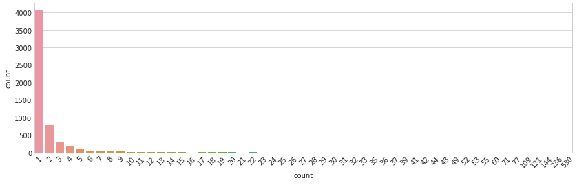

<head>
    <h1 align="center">Dog Breed Identification Project</h1>
    <h2 align="center">Udacity Data Scientist Course</h2>
    <h3 align="center">Capstone project</h3>
</head>

<i>by: Eduardo Passeto</i>

<i>Udacian student</i>

---

**I. Project Overview**

The main idea of this project is to Data Scientist students have contact with the **Perceptron** technology. Udacity course for Data Science is an immersive course about how to deal and enhance data, in a lot of ways, as building **ETL**s, **Machine Learning Classifiers and Regressors**, and a lot of other techniques. As extra-classes, we can find material to deal and to build a **Deep Learning** Classifier.

So, basically, you show to a pre-trained Perceptron a picture, as that one of this guy over here (*no matter about rights about the image – it is myself!*):

And it will says something as:

> *“Sorry, nothing detected!*
> *…so, please check this image”*

Or, in hope that it works, It will give a message like:

> *“I detected something that looks like a human*
> *...and if you were a dog, your breed should be  Siky Terrier!”*

Alternatively, if the Perceptron identifies this as a dog, it will show something as:

> *“I detected something that looks like a dog”*

The theoretical concepts involved in **Perceptron** technology are not so new. I fact, an american scientist named **Frank Rosenblatt** was evolving that was known as the first Perceptron in the history, in 1958, for military applications. (Source: [Wikipedia](https://en.wikipedia.org/wiki/Perceptron))

With the evolution of computers, specially **GPU**s (Graphic Processor Units), the search for machines that could emulate the working of a biological neuron was intense. The proposal is, with the minimal human intervention, to train a machine that can make tasks involving tasks like Classification or Fitting Curves, at least so well as humans can do. Perceptrons evolved in a way that they proved to be a great alternative for some kinds of problems, as **Image Classification**.

---

**I.1. Problem Statement**

The task proposed by Udacity is to make some experimentation involving Perceptrons. For example, we can use **three** pre-trained Perceptrons to have some fun with image classification. Just suppose that you already have a (224x224 RGB) picture of yourself, of of a dog, for example.

This picture can be shown to a **Human Identifier**, for False/True classification. And then to a **Dog Identifier**, for another False/True classification. If both returns **Trues**, that means that things probably don´t goes as expected. As someone couldn’t be a dog and a human a the same time. The same for both **Falses**.

And for adding some fun to the project, if a human, and only a human was identified by the first line of Perceptrons, a third pre-trained Perceptron will try to identify the most likely dog-breed that is have some **similarities** with the image. The internal process that describes what is similar, and what is not in this case is a bit complex. It have deep connections with patterns and textures identified at the image and **not necessarily** with the dog breed itself.

Perceptrons are also known as a Deep Learning Technique, what means that it involve more than **one layer** of learning.

---

*Udacity provided for this project, a Jupyter Notebook and Extra Classes with mentorship support as part of the learning process. The programming language involved is **Python**, and also some specific libraries, as **Pandas** (for dataframe opperations), **Keras** (for Deep Learning machines), and **Numpy** (for mathematical/geometrical/vector operations), just to cite some of them.*

---

**How to Solve it**

I didn’t have a pre-built/pre-trained **Dog Identifier** Perceptron. So I took one of the nearest, that is a Human Identifier. It was based on **Haar feature-based cascade classifiers**, and is offered as a free-tool for research and education. (The complete [link](https://docs.opencv.org/3.4/d7/d8b/tutorial_py_face_detection.html))

On the other hand, **Human Identifier** Perceptron is much easier to obtain! So a Face Detector function was evolved, using **Haar cascade**, just to prepare the image, turning it into gray-scale, normalizing the pixels to range [0, 1] and turning it in a way that I could feed my already-existent Perceptron.

Perceptrons normally accept as input a structure named **Tensor**. Tensor is basically a 4D array, composed by all the information (including the graph information), for feeding the machine. These steps were made, using parts of functions already done at the Udacity Jupyter Notebook, provided, and evolving them for my purpose.

Then, in a first approach, I tried to use **Human Identifier** as a **Dog Identifier**, but the mistakes shown that this was an unacceptable practice (**metrics** are discussed in the next part of this document). Then, I took an already-done **Resnet-50** for dog identification, that, according to the metrics, showed a **satisfactory** result.

So, the first part of the problem was solved: now I have a **Dog Identifier** and a **Human Identifier**. These two Perceptrons basically give me as result a True/False, so I could solve this part.

Next, was a more **complex** task. Now I need a **Dog Breed Identifier**. And my first approach was to build one from zero, using Keras libraries. Mine was a **CNN**, starting with:

- **Conv 2D Layer** with 32 filters, a kernel size of 4 pixel-square, activation as “relu” and an input shape of (224, 224, 3) – 224 pixels, square RGB image → output Tensor (None, 221, 221, 32), with 1568 parameters

Then:

- **Max Pooling 2D Layer**, pool size = 4 for dimension reduction → output (None, 55, 55, 32)

And the next pair was:

- **Conv 2D** **Layer** + **Max Pooling 2D** **Layer** → output (None, 13, 13, 32)

Then, one more:

- **Conv 2D Layer** + **Max Pooling 2D Layer** → output (None, 2, 2, 128)

- and a **GAP Layer**, compressing and giving the adjustments to → output (None, 128), resulting on a **Dense Layer** (None, 133), with 17157 parameters, as the Output layer.

Slight variations from this CNN were also tried, with worse results (as to use 2 pixel-square kernels on CNN). The general project of a CNN is quite neat, and is given by a combination of Convolutional Layers, associated with Pooling Layers, to turn a short, wide and large input, into a long, compressed-to-1 classes vector.

---

After a bunch of tests, altering other parameters, like the **Activation Function**, and inserting **Dropout Layers**, the result was not satisfactory.

So I tried a new strategy, taking pre-trained **Bottlenecks** from a collection of classic prize-winners ones, collected by Keras. The idea is to take a well trained Bottleneck for recognition for other kind of things, as **Human Face Recognition** and just add **Dense Layers** at the end of it, for our purpose of **Dog Breed Recognition**.

And this **quite crazy** idea could work? The answer is yes, and we could achieve better results, not without some **Blood, Sweat & Tears**. I took two of the pre-trained bottlenecks from a small collection from Keras and just added the final layers.

A very illustrative process of evolving Perceptrons can be seen here:

Source: [Research Gate](https://www.researchgate.net/publication/349432700_Deep_Learning_for_Biospectroscopy_and_Biospectral_Imaging_State-of-the-Art_and_Perspectives), article from Mr Hao He.

What we are doing now, is to center our efforts on the Full Connection Layers, at the end of our new **Dog Breed Identifier** Perceptron, re-training it for the final layers and testing it for Metrics. This method is called **Transfer Learning**.

As this step involved a lot of **new metrics** testing, I create a **Charge** function. Basically it takes a **dictionary** as input, with the path for the bottleneck an a lot of customization parameters for each of the tests. It saves a lot of effort, as I can test, in just one running, kind of 4-6 different Bottlenecks/parameters settings.

So, my final part of my new Perceptron is like:

- a **Convolution 2D Layer** → output (None, 1, 1, 64) and 2097216 parameters, for specific dog patterns recognition, associated with;

- a **Max Pooling Layer** → output (None, 1, 1, 64) then;

- a **GAP Layer** → output (None, 64) and finally;

- a **Dense Layer** → output (None, 133) for our classification vector, giving the likelihoods for each of the dog breeds.

---

**Steps to solve the problem**

Our problem is to take an image, run it into a Perceptron and retrieve the most likely Class for it.

So, basically the thing that we will do (and this is valid for all the Perceptrons involved in this project) is to:

> 1. load a picture;
> 2. prepare this picture (croping it, removing things that are unnecessary, correcting defects, etc);
> 3. pre-process the data inside of it (giving it a mathematical Tensor shape);
> 4. feed a pre-trained Perceptron, taking back our result and;
> 5. a human, to take a look into the results, and checking, if everything goes well, or not\*.

*(\*or perhaps add some **metrics**, what we will discuss later)*

In my concept, all this process should look like:

---

**II. Data Analysis**

A few words about Data Analysis involved in this project. We have a bunch of things to infer about the data (humans and dogs) that we are feeding ours Perceptrons in. There are so many details in these data, that it was necessary to create a second **Jupyter Notebook**, just for doing the necessary Data Analysis.

**About the Dog Dataset**

All this Analysis is about some distortions identified when making a deeper analysis over our data sources. And they may be consulted opening the **dog\_breed\_analysis.ipynb** file, on my GitHub repository.

What I observed was basically that our Dog Pictures data is really **unbalanced**.

And this can be seen by its Statistics **summary**:

When plotting a **Boxplot** on it, it shows to me see a very unbalanced data distribution, with long whiskers on both sides:

*(\*a **Swarm** Plot was added, just to show how clusters can be seen, specially on the **right** side of the graph, for Categories Counting.)*

And visually, our **Counting** distribution tells the same history:

So, basically we are training a Dog Breed Perceptron over an unbalanced data. As the main metric that we choose was **Accuracy** for **Testing** dataset, this biased training reflects also into our metrics, as this article from Towards Data Science indicates, about metrics, specially Accuracy:

([Towards Data Science](https://towardsdatascience.com/20-popular-machine-learning-metrics-part-1-classification-regression-evaluation-metrics-1ca3e282a2ce))

The functions and code used to provide all this information where developed my me, and are provided in the notebook cited above.

A specific discussion about **Metrics** is provided later, in this document.

---

**About the Human Dataset**

Now we are showing some illustrative conclusions about Humans dataset. And it looks even **worse** than Dogs dataset.

About Describe, what I found was a very **biased** data, with few pictures of a lot of individuals and a lot of pictures of a small group of individuals:

And the **Boxplot** was so distorted in this case, that basically what we can see is only the **Swarmplot** of this basic:

>- 1-picture or 2-pictures individuals,
>- followed by so **heavy** outliers, one of them counting for 500+ pics.

And that is what our **Counting** distribution shows, in another way, so we can see 4000+ individuals with only **one** picture, constrasted by some individuals with 144, 236, 530 pictures, so a **very biased** data source*:

*(\*these guys, counting “21”, then “23”… and so on until “530” cannot be represented by a bar, as they are only **unary** – one individual value.)*

---

**2. About Metrics**

The article form Towards Data Science, named “20 metrics for AI and Machine Learning Techniques, referred before starts with the most basic metrics used for evaluating the results of a Classifier.

Let´s say here that there are conceptually **two** kinds of metrics involved in Perceptron training. The first one, not discussed here, is about the **internal evaluating** metrics, for each Layer of the Perceptron. So, sometimes we are testing on it a **Sigmoid** function, other times a **Softmax** one**,** etc..

Another thing is, how to say, you show to a pre-trained Perceptron one picture and asks it if “it is a guy, or a girl there”, or things like this. These are metrics for a **general evaluation** of our Perceptron job.

And we can start with a very **neat** metric, and by the time, start exploring more and more complex ones. One of the most basic ones is named **Accuracy**:

---

**Formula for Accuracy**

`accuracy = correct predictions / total of predictions`

And what I made at the end of the project? I simply took 6 pictures from dogs, that were already shown at the Jupyter Notebook, and add to it more 6 pics from humans, that I could find at Wikipedia (on public domain), and one more of myself, taken with my Logitech camera, a very basic one, that I adjusted using Gimp.

As the idea for this project is to explore Perceptrons, I gave an extra-challenge to mine, selecting and cropping strange pics, like an “alien” (a Vulcan named Mr. Spock, interpreted by Leonard Nimoy), a “human dog” (named Fofão), etc..

And the results for Accuracy, with this **small** data test was:

Accuracy = 6 (all the dogs were interpreted as, and only as dogs) + 4 (for humans) / 12

Or:

Accuracy = 10/12 = 5/6 or near to **83**%*

*(\*I know this is a **bad** number, as 12 pics cannot say something to take some conclusions on it. For each Perceptron I trained there is a **much better** number, at the end of each one, at my **dog\_app.ipynb**. The idea here is just to take a general look on metrics for Perceptrons, and how to interpret them.)*

---

Some critics about the metrics presented on my **dog\_app.ipynb**:

> - our **Dogs** database and specially, our **Humans** database (this one for sure) looks like a bit **old**. I can say it just because the most present people (specially Mr. George W Bush) is part of a **past** history of US. So, basically we are training and testing on an old database;
> - is there any problem on it? So, **yes**, we are introducing a new way of **bias**. Timeline bias. Just because the camera sensors were, at this time, quite different from the sensors that take pictures nowadays. And camera **lenses**, now use other technologies for focusing, and everything. A simply look at Wikipedia can tell us everything about recent evolution of digital pictures technologies. And 20 years is kind of, too many years to not consider that we are basically testing under **time biased** data!

I can build a **pathway**, about all the possible paths that a picture under our **Image Identification** system takes for each of this possible ways (as Accuracy for Dog, or Accuracy for Human + Accuracy for... Breed?). But that is not a good idea. Why?

> - just because trying do identify a **Dog Breed** at a **Human** picture is something we can do only by **fun**. The tested Accuracy for our Dog Breed Perceptron, nearing **75%** is valid only for **Dog** images!).

And finally, why to use so much Accuracy? Just because this is an experimental problem, involving a sequence of Perceptrons. And Accuracy is considered one of the most **basic** way to evaluate Machine Learning. So, you can go and do a lot of **experimentation**, just modifying one parameter here, other there, abusing from the freedom o using a very simple metric!

Now, a pair of two metrics, so used on Machine Learning techniques, **Precision** and **Recall**.

There is a good and illustrative article at [Wikipedia](https://en.wikipedia.org/wiki/Precision_and_recall). The idea is, as for [medical articles](https://pubmed.ncbi.nlm.nih.gov/2094928/), they use a lot two other metrics, **Specificity** and **Variability**. Metrics are Impregnating AI footprint too. And their names are:

---

**Formula for Precision**

`precision = true positive / true positive + false positive`

The idea for Precision is quite simple. Just suppose that I build a new alarm system based on AI. And then my alarm **triggers** when my house was to being robbed by thieves. So, basically **Precision** is talking about false positives (Type I error) over all the positives (falses and trues).

In my case, under my 12 pics shown to the Perceptrons:

Precision\_dog = 6 / 6 or 100% for the **Dogs** part and;

Precision\_human **= 6** / 6 or 100% for **Humans** part.

---

**Formula for Recall**

`recall = true positive / true positive + false negative`

Now, just suppose that I have my same AI based alarm. And it recognizes some activities as a robbing, activating some security systems, like lights and a loud siren. But sometimes it simply n**ot engage**, giving some false negatives (Type II error) over only true positives.

In my case, under my 12 pics:

Recall\_dog = 6 /6 or 100% for the **Dogs** and;

Recall\_human = 4 / 6 or 2 /3 or **67%** for the Humans.

---

**F1 Score**

`F1score = 2 ∗ precison ∗ recall / precision + recall`

F1 Score is another widely used metrics for AI and is a mix of both Precision and Recall metrics, shown before. In our present data (only 12 tests) it cannot be useful, as there are **so few** data that a metric based in so **imprecise** other metrics cannot be reliable!

---

**3. Results**

Let me start this discussion presenting something that is not properly a metric, but another way to deal with results taken from some pictures, shown to a pre-trained Perceptron. And for humans, we have:

**Table1:** Confusion Matrix for the human identifier – no distortion/recomposition applied

Some discussion about this “**human**” identifier:

> - one of the “humans” was a Vulcan (so, technically he is **not** a human). But if you consider that an actor dressed as a kind-of-elf “extraterrestrial” remains a human in his general aspect, the Perceptron identified Mr Spock/Leonard Nimoy really **well**;
> - other of the “humans” was a kind of a “Dog” named Fofão (so, idem). But if you consider that Fofão is only a **guy**, in a kind-of-dog disguise, so Mr .Orival Pessini was **well** interpreted by our Perceptron as a man;
> - a Werewolf was not interpreted as “human”, even if the picture was based on a human image. The point is this image was so graphically manipulated to create the **movie outdoor,** that perhaps the filters of our Perceptron could not work so well in textures artificially altered, so for me it is OK, that it **failed**;
> - myself posing as a dog was a terrible mistake caused by this Perceptron. I can see a man in my own pic, and the Perceptron, couldn´t. I tried to correct the deformation (horizontal compression), caused by adapting an original 800x600 image, using a decompress function, created by myself in this project, but it **not solved** the problem. Even in my decompressed image, our Perceptron didn´t make a good job, so it was a **failure**!

I also tested to compress/decompress the other human/dog pictures, just to have an intuition that if horizontal compression affects the capacity to interpret the images. And the result, horizontally deforming for almost of the images, and decompressing mine remained the same. So no gain/loss in this.

What I can say about this? In my opinion, our Perceptron is not so affected (if it is affected) by image deformation at some degree (turning 3x4 images into **square**). The same thing now for **Dogs**:

**Table2:** Confusion Matrix for the dog identifier – no distortion/recomposition applied

And about our dog identifier? It seemed to work **really well** over the shown images!

> - what to say about not interpreting Fofão as a dog? Well, it is just a **disguise**. And even if childs, and general people tends to see there a kind of a human-dog (just for fun, and that is the intention), in practice, the creators of Fofão couldn´t imitate the nature of the **textures** of a actual **dog**. So, for me, Fofão mas actually not a dog, and **well interpreted** by our Perceptron, as being not dog.

I know it is a really small dataset, so we cannot take good conclusions about it. But, we can, just for fun, train some metrics even on this.

---

**III. Implementation**

This project is structured by Functions. Each function takes some parameters and returns some results. The guiding line for creating functions in such way was to follow the **Functional Programming** paradigm when it was possible.

My functions were also migrated to a library file named **dogbreed.py**. This library also contains functions that I create for solving the notebooks for completing the tasks for the extra classes.

---

Specifically for this project, our **main flux** is:

> (starts here)
>  
> **image\_checker** → **dog\_detector**
>  
>   (also to…) &nbsp;&nbsp;&nbsp;&nbsp;&nbsp;&nbsp;&nbsp;&nbsp;→ **face\_detector**    → **resnet50\_dog\_pred**
> 

---

**face\_detector** can consume the services from:

- **emulate\_svga\_dist** (image preprocessing - optional)

* decompress\_svga\_img** (image preprocessing - optional)

---

**dog\_detector** can consume the services from:

- **emulate\_svga\_dist** (image preprocessing - optional)
- **decompress\_svga\_img** (image preprocessing – optional)

---

Auxiliary functions:

\- **load\_dataset**

\- **path\_to\_tensor /** **paths\_to\_tensor** (image transformation)

---

Other auxiliary functions (not directly in use):

\- **Resnet\_50\_predict\_labels** (experimental)

\- **VGG16\_predict\_breeds** (experimental)

\- **charge\_bottlenecks /** **charge\_bottlenecks2** (for parameters testing for dog breed training)

---

### Involved files:

- `dogg_app.ipynb` →  the most important notebook file in this project, is where you can run the project and test it for results in new images classifications;

  - if you really want to run it, you will need a computer with `Jupyter Notebook` pre-installed and an active **GPU** to run it;

  - the data files that are not provided in this **GitHub**, you will need to donwload them from the propper sources, in a way to run this project;

- `dog_breed_analysis.ipynb` → the complete **data analysis** for our Human / Dog images;

- `Project_Main_Relatory` → all the documentation concerning this project (including proposition, steps to implement, metrics, etc..).

---

### Versions:

- 0.3-0.4 → november, december 2021

- 0.1-0.2 → october, november 2021

- 1.0 → november, 27, 2021

... (a bunch of mistakes corrected)

- 1.4 → december, 10, 2021

Webpage [here](https://epasseto.github.io/UdacityDataScienceCapstone/)
